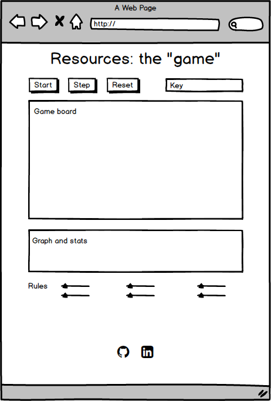

# Consumers and Producers Modeling
## Background

Consumers and Producers is based on the real-time agent-based simulation "Rabbits and Wolves"
and will at the outset utilize the **cellular automata** concept to illustrate the dynamics between consumers
and producers. The original Rabbits and Wolves plays out on a 30 x 30 rectangular grid. Each cell contains one of the following:
a young prey, an adult prey, a young predator, an adult predator, and land that is one of 3 stages of "food" content. The different actors will be represented by colors (age being a lighter shade of the color).

Each board starts with 20 prey and 5 predators distributed randomly across the board.

**Game Rules**
1. Two prey cannot occupy the same section of grass.
2. Two predators cannot occupy the same section of grass.
3. Each prey can only eat grass when he has not reached his maximum food capacity. (The maximum food capacity can be modified).
4. A predator will not eat a prey if the prey will make him surpass his maximum food capacity. (The maximum food capacity can be modified).
5. Prey and wolves can only reproduce when they reach a certain age and have a sufficient amount of food. (The age of reproduction and amount of food required to reproduce can be modified).
6. A prey cannot reproduce if there is a predator around her.
7. Rabbits and wolves can only move up, down, left, or right one space at a time.
8. Rabbits and wolves die if they get too old or if there is insufficient food. (Maximum age can be modified).
9. The grass growth rate is 1. (This growth rate can be modified).

**Prey:**

1. Maximum food capacity: 45 units
2. Metabolism rate: 3 units/stage
3. Reproduction age: 10 stages
4. Probability of reproduction in a suitable environment: 50%
5. Minimum food requirement to reproduce: 40 units
6. Maximum age: 25 stages
7. A prey gives a food value of 10 to the predator that eats it.

Using this information, along with the general rules, the computer will determine whether each prey will live, die, or reproduce during each stage.

**Predators:**

1. Maximum food capacity: 200 units
2. Metabolism rate: 2 units/stage
3. Reproduction age: 10 stages
4. Probability of reproduction in a suitable environment: 50%
5. Minimum food requirement to reproduce: 120 units
6. Maximum age: 50 stages

Using this information, along with the general rules, the computer will determine whether each predator will live, die, or reproduce at each stage.

## Functionality & MVP
Within this simulator, users will be able to:
- [ ] Start, pause/step, and reset the game board.
- [ ] Set different parameters for the rules listed above.

In addition, this project will include:
- [ ] Stats displayed on the page
- [ ] A production Readme

## Wireframes

This app will be displayed on a single screen that contains the game board, rules, sliders for changing parameters, a graph, and stats. The bottom of the page will also contain links to my Linkedin and Github.



## Architecture and Technologies

This project will be implemented with Vanilla Javascript for overall structure and game logic, Easel.js with HTML5 Canvas for DOM Manipulation and rendering, and Webpack to bundle and serve up the various scripts.

The scripts in the app will consist of:
- a webpack entry file
- ```board.js```: handles the logic for creating and updating Easel.js elements and rendering them to the DOM.
- ```automata.js```: handles the logic behind the scenes. An Automata object will hold a 2D array of ```Cell```s, and be responsible for doing neighbor checks for each ```Cell``` upon iteration and updating the Cell array appropriately.
-```cell.js``` will hold a ```type``` (Predator, Prey, Food), a ```stage``` (dead, young, adult), a constructor, and update functions for the ```Cell``` object. Each will contain  
- ```predator.js```module will house the constructor and the logic for updating the ```Predator```.
- ```prey.js``` module will house the constructor and the logic for updating the ```Prey```.
- ```food.js``` module will house the constructor and the logic for updating the ```Food```.

## Implementation Timeline

**Day 1:** Set up all necessary ```Node``` modules, get ```webpack``` up and running, and ```Easel.js``` installed. Create ```webpack.config.js``` as well as ```package.json```. Write the entry file and outline of the scripts listed above. Learn the basics of Easel.js.
***Goals***
- Successfully bundle with ```Webpack```.
- Learn enough ```Easel.js``` to render an object to the Canvas element.
- Refresh on connecting all the modules together for game play.
- Set up ```Board.js```.

**Day2:** Learn ```Easel.js``` API. Build out basic Cell, Predator, Prey, and Food objects to connect to the Board object. Create and render a 30x 30 grid, with the ability to toggle stages for each cell.

***Goals***
- Complete the ```cell.js``` module (constructor, update functions)
- Complete the ```predator.js ```module (constructor, update functions)
- Complete the ```prey.js``` module (constructor, update functions)
- Complete the ```food.js``` module (constructor, update functions)
- Render a 30x30 grid to the Canvas using ```Easel``````.js```

**Day3:** Complete logic on the backend. Build out functions on each module for their particular rules, using variables whose values can be changed.
***Goals***
- Export ```Predator```, ```Prey```, and ```Food``` object into the ```Cell``` which links to the ```Automata``` object with correct handling logic.
- Have a functional grid on the ```Canvas``` frontend that handles iterations for each step.
- Have stats that render as the game runs.

**Day4:** Create sliders and buttons for the user to interact with the game. Style the frontend. Add graph to the page, time permitting (bonus).
***Goals***
- Create buttons for start, step, reset.
- Create parameter sliders that change parameters for predator, prey, and food.
- Have a polished and modern looking ```Canvas```.
- If time: Add graph, toggle color scheme.

## Bonus Features
- [ ] Set different colors for the various actors.
- [ ] A population graph that changes as the game runs.
- [ ] Add options for game board size
- [ ] Allow options for different types of consumers and producers.
